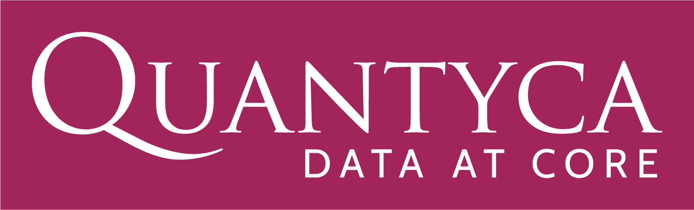

# Quantyca

{: style="height:5em"}

<a href="https://www.quantyca.it/" target="_blank">Quantyca :octicons-link-external-24:</a> is a technology consulting company specialized in Data and Metadata Management.

We work with all business and IT functions to help our customers become more competitive, exploiting the potential made available by new technologies. All the services we offer are targeted to extract the maximum value from the data realizing data platforms that are responsive, resilient, and able to evolve.

With over 100 active successful projects, we are a reliable partner to support companies: we build, together with our customers, solutions that can grow and produce value over time.

We design, develop and maintain hybrid data and integration platforms for data management throughout the life cycle, from ingestion to exploitation, along with all the integration phases. We also offer customized training and consulting services to support our customers in defining and implementing their data strategy. Quantyca’s team consists of 80+ highly specialized consultants with strong skills in Data Engineering, Advanced Analytics, Software Engineering, Project Management and Software Reliability Engineering (SRE).

We have constantly improved our technology portfolio and invested in technical excellence on the tools and products that we selected: we currently have more than 90 active certifications. We also establish a deep relationship with the Data Management and Cloud technology vendors.