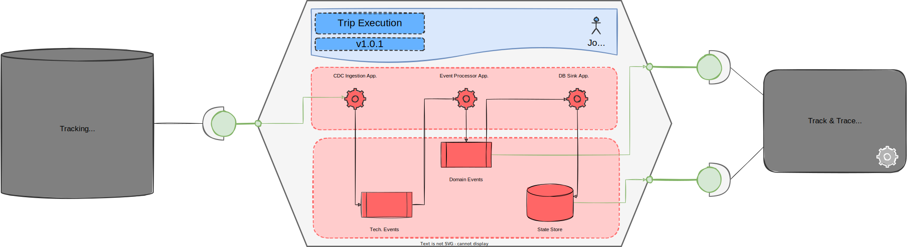

# Trip Execution Data Product Overview
The Trip Execution Data Product is used through all the quickstart to explain the specification in its main parts. This page provides an overview of this data product.

## Context
The Trip Execution Data Product belongs to the *Transport Execution Domain* of a logistic company named *company-xyz*. The domain is aligned with the business capability that is in charge of operating the shipment of goods on behalf of company customers. The core business entities belonging to the domain are:

- **Transport Unit:** an inseparable unit of goods to ship. Good belonging to one Transport Unit cannot be split on different Trips.
- **Transport Order:** the goods the customer pay to be shipped. A Transport Order can be composed of multiple Transport Units.
- **Trip:** the movement of Transport Units from one origin to a destination point, executed by a vector (ex. truck). 
- **Leg**: The association between Trasport Units and Trips. Transport Units belonging to the same Transport Order can be associated with different Trips. This happens because a single Transport Unit can be moved on different Trips before arriving at its final destination but also because Transport Units belonging to the same Transport order can be split on different Trips. Finally, a Trip can be associated with Transport Units belonging to different Transport Orders.

The Trip Execution Data Product, as suggested by the name, focuses on the *Trip Entity* and how every single trip is executed. The management of data related to other core entities is delegated to other data products belonging to the same domain.

## Purpose
The Trip Execution Data Product is a source-aligned data product. Its purpose is to extract data related to trips from the operational source (i.e. the *Track Management System*) and share them with its consumers both as a sequence of relevant events related to the trip (ex. trip planned, trip started, etc...) and as an updated state of each trip. 

The latency between the occurrence of an update on the source system and when the same update is exposed to the data product consumers should be kept under one minute. 

One notable consumer of the data product is the *Track and Trace Application* that read data from this data product and other data product belonging to the domain to provide the customer an updated status of its Transport Orders.

## Architecture
The Trip Execution Data Product read the modifications committed by the Tracking Management System (TMS) to the trip aggregate directly from its SLQServer Database using Debezium as CDC tool. The CDC Ingestion Application offloads the technical events read from TMS to different Kafka topics, one for each table that composes the trip aggregate on the source database.

An event streaming app implemented using Kafka Stream transforms on the fly the incoming technical events into transactionally consistent domain events that can be used by downstream consumers. The Event Processor Appliction stores generated domain events into dedicated Kafka topics.

Finally, a sink connector materializes the updated state of the modified trips. The trip state is then stored by the DB Sink Application on the event store implemented using a Postgres database.

Summing up the Trip Execution Data Product is composed by:

- one **input port** that specifies the product's dependence on the upstream tables that compose the trip aggregate managed by the TMS 
- one **output port** that exposes domain events related to the trip entity through a streaming API
- one **output port** that exposes trip entity updated status through a datastore API
- three **application components**, one that offloads data from the source, one that transforms the ingested data and finally one that stores the updated data in a database
- three **infrastructural components**, one composed of topics used to store technical events, one composed of the topic used to store the domain events and finally one composed of a database used to store the updated state of each trip.

## Disclaimer
In the scenario described above, there is a single data product that reads from a source system and is consumed by only one downstream consumer. This is of course a simplification that is useful to remove unecceary complexity and focus in the following pages only on the understanding of the specification. 

In a more realistic business scenario, there would be more source system that contains trip information, let's say one for each type of vector (ex. road freight, air, sea, etc ...) and maybe also more than one for some vector type depending on the country branch of the company. At the same time, there would be some consumer-aligned data products that enrich the events coming from the upstream systems to add value for the consumer interested in tracking the status of transport orders.

## Summary
This page has shown the purpose and architecture of the Trip Execution Data product used throughout this quickstart to explain the different parts of the specification. The <a href="https://github.com/opendatamesh-initiative/odm-specification-dpdescriptor/tree/main/examples/tripexecution" target="_blank">full descriptor file :fontawesome-brands-github:</a> of this data product is available, like all other examples, on GitHub.

[The next page](./overview.md) describes the syntax and structure of a data product descriptor document in all its main building blocks.