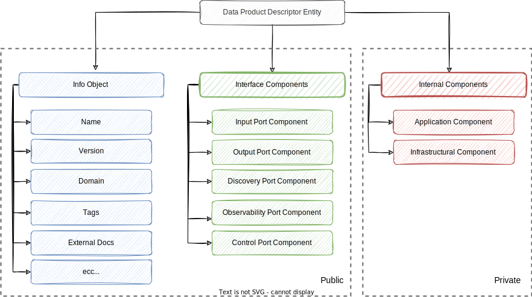

# Data Product Descriptor Document Overview
A data product descriptor document describes a data product in one or more machine-readable files. This page describes the syntax of these files and the minimal structure they must contain.

## Document Syntax
A data product descriptor document is a text file, commonly called `data-product-descriptor.json` or `data-product-descriptor.yaml`, representing a JSON object, in either JSON or YAML format. This file is called the root document and it can be split into multiple JSON or YAML files, for clarity.

This section very briefly describes these two formats and compares them.

JSON can represent **Numbers**, **Strings**, **Booleans**, `null` **values**, **Arrays** and **Objects**. An array is an ordered list of values that can have different types. An object (also called a Map) is a collection of name-value pairs where the names (also called Keys or Fields) are unique within the object and the values can have any of the supported types (including other objects or arrays).

Here’s a comparison showing the different syntaxes.

JSON:

```json
{
  "anObject": {
    "aNumber": 42,
    "aString": "This is a string",
    "aBoolean": true,
    "nothing": null,
    "arrayOfNumbers": [
      1,
      2,
      3
    ]
  }
}
```

YAML:

```yaml
# Anything after a hash sign is a comment
anObject:
  aNumber: 42
  aString: This is a string
  aBoolean: true
  nothing: null
  arrayOfNumbers:
    - 1
    - 2
    - 3
```

Basically, JSON does not support comments and requires: **commas** separating fields, **curly brackets** around objects, double **quotation marks** around strings and **square brackets** around arrays. On the other hand, YAML requires **hyphens** before array items and relies heavily on indentation, which can be cumbersome on large files (indentation is entirely optional in JSON).

The two formats are completely interchangeable (as long as [YAML 1.2](https://en.wikipedia.org/wiki/YAML#Comparison_with_JSON) is used). All examples in these pages will be given in JSON.

Because YAML is a superset of JSON both syntaxes can also be mixed. While this is not recommended in general, it can come in handy sometimes. For example:

```yaml
anObject:
  aString: This is a string
  arrayOfNumbers: [ 1, 2, 3 ] # Abbreviated array representation
```

Finally, object field names are case-sensitive: `dataproductdescriptor` is not the same thing as `dataProductDescriptor`.


## Document Structure
To be entirely precise, a data product descriptor document is a single JSON object containing fields adhering to the structure defined in the [Data Product Descriptor Specification (DPDS)](../resources/specifications/README.md).

The DPDS devides the structure of a data product descriptor document in the following three main parts:

1. **general info**
1. **interface components**
1. **internal components**

The content of *general info* part and *interface components* part is shared with other data products and the platform to enable products discoverability and self-service usage. *Internal components* instead are accessible only to the product team and to the platform.



## Trip Execution Data Product Descriptor
The following image shows the descriptor structure of the [Trip Execution Data Product](./example.md).


## Summary
This page has shown that:

- The syntax (language) used to write data product descriptor documents can be **JSON**, **YAML** or **both**.
- A data product descriptor document is a JSON (or YAML) object including the fields described in the [Data Product Descriptor Specification (DPDS)](../resources/specifications/README.md).

[The next page](./info.md) describes the minimal set of fields required to create a valid data product descriptor document.