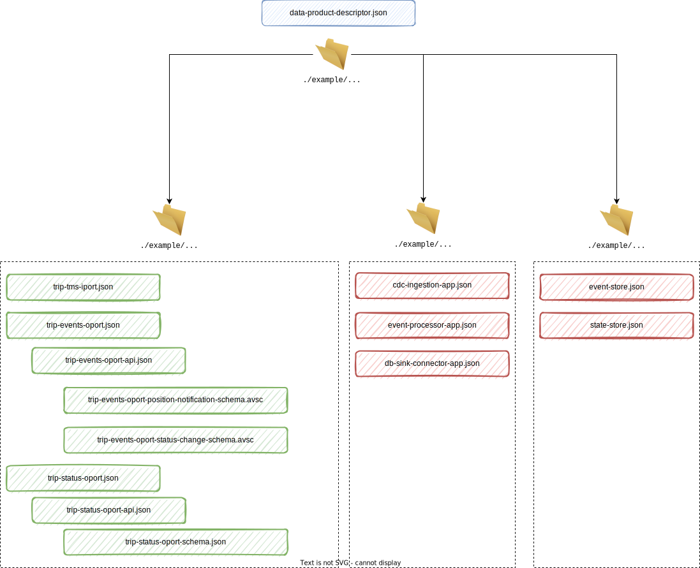

# Putting all together

You can find the full descriptor document associated with the [Trip Execution Data Product](./example.md) described throughout this overview in the <a href="https://github.com/opendatamesh-initiative/odm-specification-dpdescriptor/tree/main/examples/tripexecution" target="_blank">`tripexecution` :fontawesome-brands-github:</a> folder of the <a href="https://github.com/opendatamesh-initiative/odm-specification-dpdescriptor" target="_blank">specification's GitHub repository :fontawesome-brands-github:</a>.

The file <a href="https://github.com/opendatamesh-initiative/odm-specification-dpdescriptor/blob/main/examples/tripexecution/data-product-descriptor.json" target="_blank">specification's data-product-descriptor.json :fontawesome-brands-github:</a> is the entry point to the data product description. It describes the overall structure of the data product pointing to external resources stored in separate files to describe in detail the different interfaces and internal components (i.e. ports, applications and infra). 

```json
{
    "dataProductDescriptor": "1.0.0",
    "info": {
        "name": "tripExecution",
        "fullyQualifiedName": "urn:dpds:com.company-xyz:dataproducts:tripExecution:1",
        "version": "1.2.3",
        "domain": "Transport Management",
        "owner": {
            "id": "john.doe@company-xyz.com",
            "name": "John Doe"
        }
    },
    "interfaceComponents": {
        "inputPorts": [
            {
                "description": "Through this port trip data is ingested from TMS",
                "$ref": "https://github.com/opendatamesh-initiative/odm-specification-dpdescriptor/blob/main/examples/tripexecution/ports/tms-trip-iport.json"
            }
        ],
        "outputPorts": [
            {
                "description": "This port exposes the last known status of each trip operated in the last 12 months",
                "$ref": "https://github.com/opendatamesh-initiative/odm-specification-dpdescriptor/blob/main/examples/tripexecution/ports/trip-status-oport.json"
            },
            {
                "description": "This port expose all modifications in the status of each trip as events",
                "$ref": "https://github.com/opendatamesh-initiative/odm-specification-dpdescriptor/blob/main/examples/tripexecution/ports/trip-events-oport.json"
            }
        ]
    },
    "internalComponents": {
        "applicationComponents": [
            {
                "description": "The app that ingest data from TMS using a debezium CDC connector",
                "$ref": "https://github.com/opendatamesh-initiative/cd-ingestion-app/blob/main/examples/tripexecution/apps/cdc-ingestion-app.json"
            },
            {
                "description": "The streaming app that process incoming events and transform them into domain events usable downstream",
                "$ref": "https://github.com/opendatamesh-initiative/cd-ingestion-app/blob/main/examples/tripexecution/apps/event-processor-app.json"
            },
            {
                "description": "The app that materialize the status of a Trip from related events and store it on the state store",
                "$ref": "https://github.com/opendatamesh-initiative/cd-ingestion-app/blob/main/examples/tripexecution/apps/db-sink-connector--app.json"
            }
        ],
        "infrastructuralComponents": [
            {
                "description": "The streaming topology used to store incoming technical events and generated domain events",
                "$ref": "https://github.com/opendatamesh-initiative/cd-ingestion-app/blob/main/examples/tripexecution/infra/event-store.json"
            },
            {
                "description": "The database schema used to store the updated status of each Trip",
                "$ref": "https://github.com/opendatamesh-initiative/cd-ingestion-app/blob/main/examples/tripexecution/infra/state-store.json"
            }
        ]
    }
}
```

In particular, there is a subfolder for each component type:  <a href="https://github.com/opendatamesh-initiative/odm-specification-dpdescriptor/tree/main/examples/tripexecution/ports" target="_blank">one for ports components :fontawesome-brands-github:</a> ,  <a href="https://github.com/opendatamesh-initiative/odm-specification-dpdescriptor/tree/main/examples/tripexecution/apps" target="_blank">one for application components :fontawesome-brands-github:</a>  and  <a href="https://github.com/opendatamesh-initiative/odm-specification-dpdescriptor/tree/main/examples/tripexecution/infra" target="_blank">one for infrastructural components :fontawesome-brands-github:</a>. 

These subfolders contain one file for each component of the specific type pointed by the main descriptor file in the parent folder (ex. one file for each application component). 

Finally, in the `ports` folder for each port, aside from the file that contains the overall description of the port, there is also one separate file that contains the port's *API definition* and one that contains the *schema definitions* used by the API.

The overall structure of folders and files is shown in the following image.



