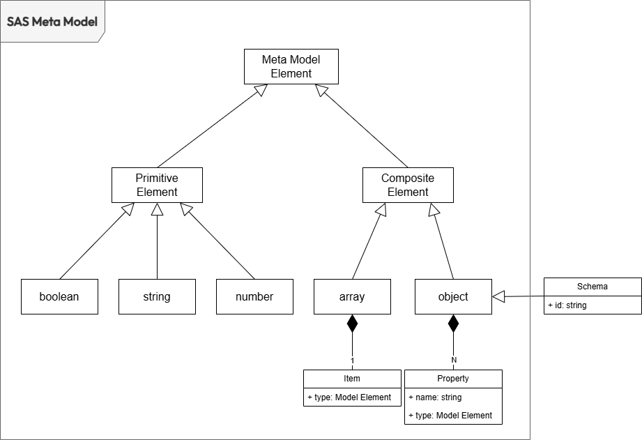

# Schema Annotations Specification

## Introduction

The Schema Annotation Specification (SAS) defines how to annotate structural elements within a schema describing a data model with metadata. SAS is independent of the Schema Definition Language (SDL) used, meaning it can be applied alongside any SDL (e.g., JSON Schema, Avro, Protobuf, XSD, etc.).

Defining schema annotations through an open specification is useful for:

- Adding descriptive metadata directly within the schema that describes how data is structured, both at rest and in transit.
- Allowing developers to use their preferred SDL while embedding metadata without needing to learn a separate formalization for specifying it.
- Ensuring that wherever the schema is used, the metadata is also available.
- Enabling tools that extract metadata from the schema to leverage standardized semantics, interpreting their meaning and using them appropriately

## Conventions and Terminology
The keywords "MUST", "MUST NOT", "REQUIRED", "SHALL", "SHALL NOT", "SHOULD", "SHOULD NOT", "RECOMMENDED", "NOT RECOMMENDED", "MAY", and "OPTIONAL" in this document are to be interpreted as described in <a href="https://tools.ietf.org/html/bcp14" target="_blank">BCP 14:octicons-link-external-24:</a>, <a href="https://tools.ietf.org/html/rfc2119" target="_blank">RFC2119:octicons-link-external-24:</a> and <a href="https://tools.ietf.org/html/rfc8174" target="_blank">RFC8174:octicons-link-external-24:</a>, when, and only when, they appear in all capitals, as shown here.

## <a name="versions"></a>Versions

The SAS is versioned using <a href="https://semver.org/spec/v2.0.0.html)" target="_blank">Semantic Versioning 2.0.0:octicons-link-external-24:</a> (semver) and follows the semver specification.

The `major`.`minor` portion of the semver (for example `1.0`) SHALL designate the SAS feature set. Typically, *`.patch`* versions address errors in this document, not the feature set. Tooling which supports SAS 1.0 SHOULD be compatible with all SAS 1.0.\* versions. The patch version SHOULD NOT be considered by tooling, making any distinction between `1.0.0` and `1.0.1` for example.

Each new minor version of the SAS SHALL produce annotations that are enterpretable by consumers in the same way as in any previous minor version of the Specification, within the same major version. Such an update MUST only require changing the `sas` property to the new minor version.

For example, a valid schema document annotated using SAS 1.0.2, upon changing its `sas` property to `1.1.0`, SHALL be a valid schema document annotated with SAS 1.1.0, semantically equivalent to the original schema document. New minor versions of the SAS MUST be written to ensure this form of backward compatibility.

## License
This document is licensed under <a href="https://www.apache.org/licenses/LICENSE-2.0.html" target="_blank">The Apache License, Version 2.0:octicons-link-external-24:</a>.

## Table of Contents

- [Schema Annotations Specification](#schema-annotations-specification)
  - [Introduction](#introduction)
  - [Conventions and Terminology](#conventions-and-terminology)
  - [Versions](#versions)
  - [License](#license)
  - [Table of Contents](#table-of-contents)
  - [Definitions](#definitions)
    - [Standard](#standard)
    - [Standard Specification](#standard-specification)
    - [Standard Definition](#standard-definition)
    - [Schema](#schema)
    - [Schema Definition Language](#schema-definition-language)
    - [Schema Annotation](#schema-annotation)
    - [Schema Document](#schema-document)
    - [SAS Specification](#sas-specification)
  - [Specification](#specification)
    - [Meta Model](#meta-model)
    - [Schema Definition Language](#schema-definition-language-1)
      - [JSON Schema](#json-schema)
      - [Avro](#avro)
      - [Protobuf](#protobuf)
      - [XSD](#xsd)
    - [Keywords](#keywords)
    - [Vocabularies](#vocabularies)
    - [The "sas" Keyword](#the-sas-keyword)
    - [The "sasSchemaId" Keyword](#the-sasschemaid-keyword)
    - [The "sasDialect" Keyword](#the-sasdialect-keyword)
    - [Default SAS Dialect](#default-sas-dialect)
  - [Basic Meta-Data Annotations Vocabulary](#basic-meta-data-annotations-vocabulary)
    - [Keywords applicable to schema or properties](#keywords-applicable-to-schema-or-properties)
      - [title](#title)
      - [description](#description)
      - [default](#default)
      - [deprecated](#deprecated)
    - [Keywords applicable only to properties](#keywords-applicable-only-to-properties)
      - [writeOnly](#writeonly)
      - [writeOnly](#writeonly-1)
  - [Logical Meta-Data Annotations Vocabulary](#logical-meta-data-annotations-vocabulary)
    - [Keywords applicable to schema or properties](#keywords-applicable-to-schema-or-properties-1)
      - [summary](#summary)
      - [modelRole](#modelrole)
      - [tags](#tags)
      - [externalDocs](#externaldocs)
    - [Keywords applicable only to schema](#keywords-applicable-only-to-schema)
      - [owner](#owner)
      - [domain](#domain)
      - [schemaType](#schematype)
      - [modellingStyle](#modellingstyle)
      - [contactPoints](#contactpoints)
      - [status](#status)
    - [Keywords applicable only to properties](#keywords-applicable-only-to-properties-1)
      - [primaryKey](#primarykey)
      - [primaryKeyPosition](#primarykeyposition)
      - [unique](#unique)
      - [nullable](#nullable)
      - [nullValuesEnum](#nullvaluesenum)
      - [nullValuesPattern](#nullvaluespattern)
      - [validityTime](#validitytime)
      - [creationTime](#creationtime)
      - [lastUpdateTime](#lastupdatetime)
      - [deletionTime](#deletiontime)
      - [sequenceKey](#sequencekey)
      - [watermarkKey](#watermarkkey)
  - [Physical Meta-Data Annotations Vocabulary](#physical-meta-data-annotations-vocabulary)
    - [Keywords applicable to schema or properties](#keywords-applicable-to-schema-or-properties-2)
      - [physicalName](#physicalname)
      - [physicalType](#physicaltype)
    - [Keywords applicable only to properties](#keywords-applicable-only-to-properties-2)
      - [partitionKey](#partitionkey)
      - [partitionKeyPosition](#partitionkeyposition)
  - [Constraint Annotations Vocabulary](#constraint-annotations-vocabulary)
    - [Keywords applicable to any properties](#keywords-applicable-to-any-properties)
      - [enum](#enum)
      - [const](#const)
    - [Keywords applicable to numeric properties](#keywords-applicable-to-numeric-properties)
      - [multipleOf](#multipleof)
      - [maximum](#maximum)
      - [exclusiveMaximum](#exclusivemaximum)
      - [minimum](#minimum)
      - [exclusiveMinimum](#exclusiveminimum)
    - [Keywords applicable to string properties](#keywords-applicable-to-string-properties)
      - [maxLength](#maxlength)
      - [minLength](#minlength)
      - [pattern](#pattern)
    - [Keywords applicable to array properties](#keywords-applicable-to-array-properties)
      - [maxItems](#maxitems)
      - [minItems](#minitems)
    - [Keywords applicable to object properties](#keywords-applicable-to-object-properties)
      - [maxProperties](#maxproperties)
      - [minProperties](#minproperties)
      - [required](#required)
      - [dependentRequired](#dependentrequired)
  - [String-encoded Content Vocabulary](#string-encoded-content-vocabulary)
    - [Keywords applicable to string properties](#keywords-applicable-to-string-properties-1)
      - [contentEncoding](#contentencoding)
      - [contentMediaType](#contentmediatype)
      - [contentSchema](#contentschema)
  - [Format Annotation Vocabulary](#format-annotation-vocabulary)
    - [Keywords applicable to properties](#keywords-applicable-to-properties)
      - [format](#format)
  - [Syntactic Context Annotations Vocabulary](#syntactic-context-annotations-vocabulary)
    - [Keywords applicable only to properties](#keywords-applicable-only-to-properties-3)
      - [conformsTo](#conformsto)
  - [Semantic Context Annotations Vocabulary](#semantic-context-annotations-vocabulary)
    - [Keywords applicable only to schema](#keywords-applicable-only-to-schema-1)
      - [semanticContext](#semanticcontext)
  - [Data Quality Annotation Vocabulary](#data-quality-annotation-vocabulary)
- [Appendix A: Revision History](#appendix-a-revision-history)


## <a name="definitions"></a>Definitions

### <a name="definitionsStandard"></a>Standard
The set of shared rules used by different agents to describe an entity or process of common interest. By conforming to these rules, agents limit their autonomy to enable interoperability, allowing for smoother cooperation.

### <a name="definitionsSpecification"></a>Standard Specification
The formal description of the rules that form a [standard](#definitionsStandard). A standard can have multiple specification versions associated with it. Sometimes the words standard and specification are used as synonymous. 

### <a name="definitionsDefinition"></a>Standard Definition
The description of one specific entity or process created using and conforming to the set of rules formally described in the [standard specification](#definitionsSpecification)

### <a name="definitionsSchema"></a>Schema
A schema is a machine-readable description of the structure of a dataset. It can be used to validate the structure of a dataset, to decide how to query it, and to encode the results.

### <a name="definitionsSchemaDefinitionLanguage"></a>Schema Definition Language
A schema definition language is the formalism used to describe the schema of a dataset (es. JSON Schema, Avro Schema, Protobub, XML Schema, etc...)

### <a name="definitionsSchemaAnnotation"></a>Schema Annotation
A schema annotation is a piece of information embedded in the schema definition to add metadata related to a specific part of the structure. The annotation is not directly used for validating or encoding the data.

### <a name="definitionsSchemaDocument"></a>Schema Document
The document (or set of documents) that contains the schema definition.

### <a name="definitionsSAS"></a>SAS Specification
The list of standard annotations that can be used describes the different parts of the schema defined in a [Schema Document](definitionsSchemaDocument).


## <a name="specification"></a>Specification

### <a name="metaModel"></a>Meta Model

A dataset is a structured collection of data. Each entry within the dataset adheres to the same structure, which is referred to as its **data model**. The data model defines how data within each entry are arranged and related. 

A **meta model** provides the framework for defining the data model of a dataset. In SAS, the meta model describes the structure of a dataset entry as an `object` (i.e. root object or schema) consisting of an unordered list of named properties. 



Each property represents a portion of the data within a dataset entry and can take one of two forms:

- **Primitive Properties:** When a property’s type is a primitive element of the meta model (e.g., `boolean`, `number`, `string`), it describes a single, specific data point within the entry.

- **Composite Properties:** When a property’s type is a composite element of the meta model (e.g., `array`, `object`), it describes a nested collection of data points within the parent entry.

A data model consisting only of primitive properties is said to have a **tabular structure**, while one that incorporates composite properties is described as having a **document structure**. 

### <a name="schemaDefinitionLanguage"></a>Schema Definition Language

A **schema** is a machine-readable representation of a data model defined using a specific **Schema Definition Language (SDL)**. Each SDL is grounded in a foundational meta-model that shapes the keywords and syntax the language uses to describe the schema of a specific data model.

Keywords used by an SDL can be divided into three main categories:

- **Core keywords**: These define the basic structure of the data model. For example, in JSON Schema, keywords like `$id`, `object`, `properties`, `string`, `number`, and `boolean` are used to shape the model.

- **Functional keywords**: These are reserved keywords that trigger specific actions in the supporting tools. Their behavior depends on the context in which the SDL is defined. In most DSLs, functional keywords are used to validate schema instances (i.e., entries in the dataset). For example, in JSON Schema, the keyword `required` specifies which properties are mandatory in an object.

- **Annotation keywords**: These keywords are not reserved and don’t trigger any specific behavior. Instead, they provide additional information to enhance the data model (metadata). For example, in JSON Schema, the `description` keyword is used to add a textual explanation of a property.
  
SAS specifies how to define and use annotation keywords within any SDL that can describe data models with both tabular and document structures.

#### <a name="sdlJsonSchema"></a>JSON Schema
In [JSON Schema](https://json-schema.org/) any keywords not defined by the [specification](https://json-schema.org/draft/2020-12) is considered by default an annotation keyword.

> [from JSON Schema Specification] unrecognized individual keywords simply have their values collected as annotations

In the following example, `author` and `unit` are annotations. The `author` annotation specifies that *Andrea* created the schema, while the `unit` annotation indicates that the temperatures in the dataset must be expressed in *degrees Celsius*.

```json
{
  "type": "object",

  "author": "Andrea",

  "properties": {
    "temperatures": {
      "type": "array",
      "items": {
        "type": "number",
    "unit": "Celsius"
      },
    },
    "sensor": {
      "type": "object",
      "properties": {
        "id": {
          "type": "string",
        },
        "location": {
          "type": "string",
        }
      },
      "required": ["id", "location"],
    }
  },
  "required": ["temperatures", "sensor"]
}
```

#### <a name="sdlAvro"></a>Avro

In [Avro](https://avro.apache.org/) any keywords not defined by the [specification](https://avro.apache.org/docs/1.11.1/specification/) is considered by default an annotation keyword.

> [from Avro Specification] Attributes not defined in this document are permitted as metadata, but must not affect the format of serialized data.

The following example specify with Avro a data model structure equivalent to the one defined in the JSON Schema example of previous section.

```json
{
  "type": "record",
  "name": "TemperatureData",

  "author": "Andrea",

  "fields": [
    {
      "name": "temperatures",
      "type": {
        "type": "array",
        "items": "double",
    "unit": "Celsius"
      }
    },
    {
      "name": "sensor",
      "type": {
        "type": "record",
        "name": "Sensor",
        "fields": [
          {
            "name": "id",
            "type": "string"
          },
          {
            "name": "location",
            "type": "string"
          }
        ]
      }
    }
  ]
}
```

#### <a name="sdlProtoBuf"></a>Protobuf

In [Protobuf](https://protobuf.dev/), annotations must be defined through [custom options](https://protobuf.dev/programming-guides/proto3/#enum-value-options), as shown in the following example:

```proto
syntax = "proto3";

// Import custom options from sas-annotations.proto
import "sas-annotations.proto";  

message TemperatureData {
 
  // Apply message option for author
  option (author) = "Andrea";

  // Apply field option for temperature unit
  repeated double temperatures = 1 [(temperature_unit) = "Celsius"];
  
  message Sensor {
    string id = 1;
    string location = 2;
  }

  Sensor sensor = 2;
}
```

where `sas-annotation.proto` is defiend as follow

```proto
syntax = "proto3";

import "google/protobuf/descriptor.proto";

// Define custom options for message annotations
extend google.protobuf.MessageOptions {
  string author = 50001;  // Custom option for message author
}

// Define custom options for field annotations
extend google.protobuf.FieldOptions {
  string temperature_unit = 50002;  // Custom option for field temperature unit
}
```

#### <a name="sdlXSD"></a>XSD

In XML Schema (XSD), annotations are typically added using the <xs:annotation> element as shown in the following example.

```xml
<xs:schema xmlns:xs="http://www.w3.org/2001/XMLSchema">
  
  <xs:annotation>
    <xs:documentation>author:Andrea</xs:documentation>
  </xs:annotation>

  <xs:element name="TemperatureData">
    <xs:complexType>
      <xs:sequence>
        <xs:element name="temperatures" maxOccurs="unbounded">
          <xs:complexType>
            <xs:sequence>
              <xs:element name="temperature" type="xs:decimal">
                <xs:annotation>
                  <xs:documentation>unit:celsius</xs:documentation>
                </xs:annotation>
              </xs:element>
            </xs:sequence>
          </xs:complexType>
        </xs:element>
        <xs:element name="sensor">
          <xs:complexType>
            <xs:sequence>
              <xs:element name="id" type="xs:string"/>
              <xs:element name="location" type="xs:string"/>
            </xs:sequence>
          </xs:complexType>
        </xs:element>
      </xs:sequence>
    </xs:complexType>
  </xs:element>
  
</xs:schema>

```

### <a name="keywords"></a>Keywords
A keyword is a string to whitch is possible to associate a value to annotate a schema element. In the following example `customKeyword` is a keyword associated to the root object of the JSON Schema whose value is equal to `Custom Keyword Value`.

```json
{
  "type": "object",

  "customKeyword": "Custom Keyword Value",

  "properties": {
    "username": {"type": "string"},
  "password": {"type": "string"}
  }
}
```

While the SAS does not mandate a specific format for a keyword, it is RECOMMENDED that the keyword be defined using an alphanumeric string. Special characters should only be included in exceptional cases and when absolutely necessary. This approach aims to minimize the risk of issues when using keywords in the context of specific DSLs, which may impose restrictions on keyword formats.

Defining a keyword and using it to annotate a schema is not enough. Each keyword must have a clear and precise definition to ensure its value can be effectively understood and used by potential consumers.

The definition of a keyword SHOULD include:  

- The keyword being defined (e.g., `Creator`)  
- The type of the keyword’s value (e.g., `string`, `number`, `boolean`, etc.)  
- A description of the keyword’s value (e.g., `An entity responsible for creating the resource.`)  
- Notes on best practices for setting the keyword's value (e.g., `It is recommended to identify the creator using a URI. If this is not possible, a literal value that identifies the creator may be used.`)  
- Any potential relationships with other keywords (e.g., `Creator` is a subproperty of `Contributor`).  


### <a name="vocabularies"></a>Vocabularies
A vocabulary is a collection of keyword definitions. Every vocabulary MUST have a unique URI that serves as its identifier, ensuring global distinctiveness and referenceability. It is RECOMMENDED to use a URL as the identifier, allowing potential consumers not only to identify the vocabulary but also to access it. 

Each keyword in a vocabulary can be uniquely identified by appending it as a fragment identifier to the vocabulary's URI. For example, if the keyword `customKeyword` belongs to the vocabulary identified by the URI `http://example.com/custom-vocabulary`, then its unique identifier SHOULD be `http://example.com/custom-vocabulary#customKeyword`.

This makes the relationship between the vocabulary's URI and the keyword's identifier clearer.

To promote clarity, consistency and composability, keywords within the same vocabulary SHOULD be associated with a specific metadata class, such as physical, logical, conceptual, quality, or security metadata. 

The actual structure and format of a vocabulary is not prescribed and remains open to the discretion of the defining authority.

### <a name="sasDialect"></a>The "sas" Keyword
The `sas` keyword, placed in the root object of a schema, specifies the SAS version used.

The value of this keyword MUST be a `string`.

This annotation is REQUIRED in order to properly interpret the other keywords used to annotate the schema.

### <a name="sasDialect"></a>The "sasSchemaId" Keyword
The `sasSchemaId` keyword, placed in the root object of a schema, specifies unique identifier of the annotated schema.

The value of this keyword MUST be a `string`.

This annotation is OPTIONAL.

### <a name="sasDialect"></a>The "sasDialect" Keyword
The `sasDialect` keyword, placed in the root object of a schema, specifies the vocabularies in use. A dialect is a collection of vocabularies.

The value of this keyword MUST be a `string` or a  `SasDialect Object` that is a JSON Object compliant with the following JSON Schema:

```json
{
  "$schema": "http://json-schema.org/draft-07/schema#",
  "type": "object",
  "propertyNames": {
    "type": "string",
    "pattern": "^https?://.*$"
  },
  "additionalProperties": {
    "type": "object",
    "properties": {
      "prefix": {
        "type": "string"
      },
	  "objectName": {
        "type": "string"
      },
	  "excludedKeywords": {
         "type": "array"
      },
	  "excludedKeywords": {
        "type": "array"
      },
	  "aliases": {
        "type": "object"
      },
	  
      "required": {
        "type": "boolean",
        "default": false
      }
    },
    "required": ["prefix"],
    "additionalProperties": false
  }
}
```

If the `sasDialect` keyword value is a string, it can either store the URI identifying the dialect definition or contain the `SasDialect Object` encoded as a string. Using a URI is advantageous as it eliminates the need to repeatedly include the same dialect definition in multiple schemas. Additionally, referencing an external definition via a URI or encoding the `SasDialect Object` as a string is particularly useful for annotating schemas defined in SDLs that do not support JSON syntax (e.g., Protobuf).

The `SaSDialect` Object includes a property for each vocabulary used in the dialect. Each property's name is the URI of the vocabulary, and its value is an object that specifies the following informations about the vocabulary:

Field Name | Type | Description
-----------|:----:|------------
<a name="SasDialectPrefix"></a>prefix | `string` | The string that prefixes each keyword in the vocabulary. Using a prefix can help prevent keyword collisions with other vocabularies. 
<a name="SasDialectPrefix"></a>objectName | `string` | The name of the parent object that contains all the keyword of this vocabulary. Grupping all annotation based on the keywords defined in a vocabulary withing a specific object can be usefull to avoid collision with keywords defined in other vocabularies or to isolate in one point all annoattion to mke easier distinguish them form core and functional keywords
<a name="SasDialectExcludedKeywords"></a>excludedKeywords | `[string]` | A list of all keywords defined in the vocabulary but not used for annotations. The `includedKeywords` and `excludedKeywords` fields are complementary, and only one of them MUST be defined. If neither `includedKeywords` nor `excludedKeywords` is defined, all keywords in the vocabulary are used for annotations
<a name="SasDialectIncludedKeywords"></a>includedKeywords | `[string]` | A list of keywords in use. Any keywords defined in the vocabulary but not included in this list are not used for annotations. The `includedKeywords` and `excludedKeywords` fields are complementary, and only one of them MUST be defined. If neither `includedKeywords` nor `excludedKeywords` is defined, all keywords in the vocabulary are used for annotations
<a name="SasDialectRequired"></a>aliases | `object` | It's an object used to map keywords defined in the vocabulary with aliases used in the schema to refer them 
<a name="SasDialectRequired"></a>required | `boolean` | If `true` the consumers that do not recognize the vocabulary MUST refuse to process the schemas

This annotation is OPTIONAL. If omitted, the [default SAS Dialect](#default-sas-dialect) is assumed.

Example-1: A dialect based on two vocabulaties

```json
    "sasDialect": {
      "https://www.dublincore.org/specifications/dublin-core/dcmi-terms": {"prefix":"dct.", "required":false},
      "https://bitol-io.github.io/open-data-contract-standard/v3.0.0/#quality": {"prefix":"bitol.","required":false}
    },
```

Example-2: Groupping all annotations withing an object

```json
{
  "sasDialect": {
    "https://www.dublincore.org/specifications/dublin-core/dcmi-terms": {
      "objectName": "annotations", 
	  "prefix":"dct.", 
	  "required":false
	},
    "https://bitol-io.github.io/open-data-contract-standard/v3.0.0/#quality": {
      "objectName": "annotations", 
	  "prefix":"bitol.",
	  "required":false
    }
  }
}
```

Example-3: Including and excluding specific keywords

```json
{
  "sasDialect": {
    "https://www.dublincore.org/specifications/dublin-core/dcmi-terms": {
	  "prefix":"dct.", 
	  "includedKeywords": [],
	  "required":false
	},
    "https://bitol-io.github.io/open-data-contract-standard/v3.0.0/#quality": {
	  "prefix":"bitol.",
	  "escludedKeywords": [],
	  "required":false
    }
  }
}
```

Example-4: Defining aliases

```json
{
  "sasDialect": {
    "https://www.dublincore.org/specifications/dublin-core/dcmi-terms": {
	  "prefix":"dct.", 
	  "escludedKeywords": ["Title"],
	  "required":false
	},
    "https://bitol-io.github.io/open-data-contract-standard/v3.0.0/#schema": {
	  "prefix":"bitol.",
	  "aliases": {"logicalName": ["title"]},
	  "required":false
    }
  }
}
```

*Example-5: Avro Schema*

```json
{
  "name": "EmailMessage",
  "type": "record",
    
  "sasDialects": {
    "https://www.dublincore.org/specifications/dublin-core/dcmi-terms": {"required":false}
  },

  "Title": "email",
  "Description": "This schema describe the basic structure of an email",

  "fields": [
    {
      "name": "subject",
    "type": "string"
    },
    {
      "name": "message",
      "type": "string"
    }
  ]
}
```

*Example-6: Protobuf*

```proto
syntax = "proto3";

// Import custom options from sas-annotations.proto
import "sas-annotations.proto";  

message TemperatureData {
 
  // Apply message option for author
  option (sasDialects) = "{\"https://www.dublincore.org/specifications/dublin-core/dcmi-terms\": {\"required\":false}};";

  option (Title) = "email";
  option (Description) = "This schema describe the basic structure of an email";
  
  message Email {
    string subject = 1;
    string message = 2;
  }
}
```

where `sas-annotation.proto` is defiend as follow

```proto
syntax = "proto3";

import "google/protobuf/descriptor.proto";

// Define custom options for message annotations
extend google.protobuf.MessageOptions {
  string sasDialects = 50001;  

   // Dublin Core Term Vocabulary
   string Title = 50002;  
   string Description = 50003;  
}
```

### <a name="defaultDefaultSasDialect"></a>Default SAS Dialect
If `sasDialect` is absent, the consumer MAY assume that all annotation keywords are defined within one of the vocabularies associated with the default SAS Dialect, defined as follows:

```json
{
  "sasDialect": {
    "https://json-schema.org/draft/2020-12/vocab/meta-data": {"required":false},
    "https://dpds.opendatamesh.org/specifications/sas/1.0.0-DRAFT/vocab/meta-data-logical": {"required":false},
    "https://dpds.opendatamesh.org/specifications/sas/1.0.0-DRAFT/vocab/meta-data-physical": {"required":false},
    "https://dpds.opendatamesh.org/specifications/sas/1.0.0-DRAFT/vocab/constraints": {"required":false},
    "https://json-schema.org/draft/2020-12/vocab/content": {"required":false},
    "https://json-schema.org/draft/2020-12/vocab/format-annotation": {"required":false},
    "https://dpds.opendatamesh.org/specifications/sas/1.0.0-DRAFT/vocab/context-syntactic": {"required":false},
    "https://dpds.opendatamesh.org/specifications/sas/1.0.0-DRAFT/vocab/context-semantic": {"required":false},
    "https://bitol-io.github.io/open-data-contract-standard/v3.0.0/#quality": {"required":false},
  }
}
```

The vocabularies included in the **default SAS Dialect** are described in the following sections.

<!-- ============================================================================ -->
<!-- Basic Meta-Data Annotations Vocabulary                     -->
<!-- ============================================================================ -->
## <a name="vocab-meta-data"></a>Basic Meta-Data Annotations Vocabulary

These general-purpose annotation vocabulary defided in [JSON Schema Validation](https://json-schema.org/draft/2020-12/json-schema-validation) extension provide commonly used information for documentation and user interface display purposes. They are not intended to form a comprehensive set of features. Rather, additional vocabularies can be defined for more complex annotation-based applications.

The current URI for this vocabulary, known as the Meta-Data Vocabulary, is: <a href="https://json-schema.org/draft/2020-12/vocab/meta-data" target="_blank">https://json-schema.org/draft/2020-12/vocab/meta-data</a>

The current URI for the corresponding meta-schema is: <a href="https://json-schema.org/draft/2020-12/meta/meta-data" target="_blank">https://json-schema.org/draft/2020-12/meta/meta-data</a>

*Hereafter are reported all keywords that compose this vocabulary with a short description for convenience. However the normative definition is contained in the <a href="https://json-schema.org/draft/2020-12/json-schema-validation" target="_blank">JSON Schema Validation</a> extension.*


### <a name="vocab-meta-data-element-kws"></a>Keywords applicable to schema or properties

<!-- title -->
####  <a name="vocab-meta-data-kw-title"></a>title
*This description is provided here for convenience, but it is not normative. The normative description is defined in the original vocabulary and can be found [here](https://json-schema.org/draft/2020-12/json-schema-validation#name-title-and-description)*

The value of this keyword MUST be a `string`.  

The `title` keyword specifies the human-readable name of the element that can be used by frontend tools. It SHOULD be a short text.

This keyword is equivalent to:

- [`bitol.schema.logicalName`](https://bitol-io.github.io/open-data-contract-standard/v3.0.0/#schema)

<!-- description -->
####  <a name="vocab-meta-data-kw-description"></a>description
*This description is provided here for convenience, but it is not normative. The normative description is defined in the original vocabulary and can be found [here](https://json-schema.org/draft/2020-12/json-schema-validation#name-title-and-description)*

The value of this keyword MUST be a `string`.

The `description` keyword specifies the description of the element. CommonMark syntax MAY be used for rich text representation.

This keyword is equivalent to:

- [`bitol.schema.description`](https://bitol-io.github.io/open-data-contract-standard/v3.0.0/#schema)

<!-- default -->
####  <a name="vocab-meta-data-kw-default"></a>default
*This description is provided here for convenience, but it is not normative. The normative description is defined in the original vocabulary and can be found [here](https://json-schema.org/draft/2020-12/json-schema-validation#name-default)*

There are no restrictions placed on the value of this keyword.

The `default` keyword specifies the value that MAY be used for the element when it is not explicitly defined.

<!-- deprecated -->
####  <a name="vocab-meta-data-kw-deprecated"></a>deprecated
*This description is provided here for convenience, but it is not normative. The normative description is defined in the original vocabulary and can be found [here](https://json-schema.org/draft/2020-12/json-schema-validation#name-deprecated)*

The value of this keyword MUST be a `boolean`.

When set to `true`, the `deprecated` keyword specifies that consumers SHOULD avoid using the declared property, as it may be removed in the future.

A schema containing the `deprecated` keyword set to `true` indicates that the entire resource being described MAY be removed in the future.

Omitting this keyword has the same behavior as a value of `false`.

### <a name="vocab-meta-data-property-kws"></a>Keywords applicable only to properties

<!-- writeOnly -->
####  <a name="vocab-meta-data-kw-writeOnly"></a>writeOnly
*This description is provided here for convenience, but it is not normative. The normative description is defined in the original vocabulary and can be found [here](https://json-schema.org/draft/2020-12/json-schema-validation#name-readonly-and-writeonly)*

The value of this keyword MUST be a `boolean`.

When set to `true`, the `readOnly` keyword indicates that the value of the element is managed exclusively by the owner of the underlyng datastore, and attempts by an application to modify the value of this element are expected to be ignored or rejected by that owner.

An schema element that is marked as `readOnly` MAY be ignored if sent to the owning authority, or MAY result in an error,  at the datastore owner's discretion.

*Example-1:*

For example, `readOnly` MAY be used to mark a database-generated serial number as read-only.

```json
{
  "properties": {
    "userId": {
      "type": "string",
      "readOnly": "true"
    }, "username": {
      "type": "string"
    }
  }
}
```

<!-- writeOnly -->
####  <a name="vocab-meta-data-kw-writeOnly"></a>writeOnly
*This description is provided here for convenience, but it is not normative. The normative description is defined in the original vocabulary and can be found [here](https://json-schema.org/draft/2020-12/json-schema-validation#name-readonly-and-writeonly)*

The value of this keyword MUST be a `boolean`.

When set to `true`, the `writeOnly` keyword indicates that the value of the element is never present when data is retrieved from the source datastore. It can be present when sent to the owner of the underlying datastore to create a new item or update an existing one.

An schema element that is marked as `writeOnly` MAY be returned as a blank document of some sort, or MAY produce an error upon retrieval, or have the retrieval request ignored, at the datastore owner's discretion.

*Example-1:*

For example, `writeOnly` MAY be used to mark a property whose value is a password.

```json
{
  "properties": {
    "username": {
      "type": "string"
    }, "username": {
      "password": "string",
      "writeOnly": true
    }
  }
}
```

## <a name="vocab-meta-data-logical"></a>Logical Meta-Data Annotations Vocabulary

The Logical Meta-Data Annotations Vocabulary, defined as an extension of the SAS, provides commonly used metadata for annotating schemas at a logical level. The keywords in this vocabulary do not include, and will not include in the future, any information about the underlying datastore or details for schema or data validation.

The current URI for this vocabulary, known as the Logical Meta-Data Annotations Vocabulary, is: [<https://dpds.opendatamesh.org/specifications/sas/1.0.0-DRAFT/vocab/meta-data-logical>](./1.0.0-DRAFT/vocab/meta-data-logical.md).

The current URI for the corresponding meta-schema is: [https://dpds.opendatamesh.org/specifications/sas/1.0.0/meta/meta-data-logical.json](./1.0.0-DRAFT/meta/meta-data-logical.json).


### <a name="vocab-meta-data-logical-element-kws"></a>Keywords applicable to schema or properties

<!-- summary -->
####  <a name="vocab-meta-data-logical-kw-summary"></a>summary
The value of this keyword MUST be a `string`.

The `summary` keyword specifies a short human readable description of the element. It SHOULD be used by frontend tools to visualize the item description in lists or tooltips where there is not enough space for using the full description.

*Example-1:*

```json
{
  "title": "Leg",
  "summary": "The association between Trasport Units and Trips",
  "description": "A **Leg** is the association between a `Transport Unit` and a specific `Trip`. It represents how individual `Transport Units` are moved during a particular segment of their journey. Multiple  `Leg` can exist for a `Transport Unit` if it is moved across different `Trips` before reaching its final destination. Similarly, a single `Trip` can involve `Transport Units` from multiple `Transport Orders`.",
}
```

<!-- modelRole -->
####  <a name="vocab-meta-data-logical-kw-modellingStyle"></a>modelRole
The value of this keyword MUST be a `string`

The `modellingStyle` keyword specifies the role of a schema element within its specific modelling style, helping to clarify its function in the context of the chosen model. For example, if the `modellingStyle` is set to `starSchema`, the schema might define an entity with a `modelRole` of either `fact` or `dimension`. In this case, the properties of the schema can have a `modelRole` of either `attribute` or `measure`. On the other hand, if the `modellingStyle` is set to `rawDataVault`, the schema might define an entity with a `modelRole` of `hub`, `satellite`, or `link`. This distinction helps clarify the purpose of each element within the overall model.

<!-- tags -->
####  <a name="vocab-meta-data-logical-kw-tags"></a>tags
The value of this keyword MUST be  an `array` of `string`

The `tags` keyword specifies a list of tags associated to the element.

This keyword is equivalent to:

- [`bitol.schema.tags`](https://bitol-io.github.io/open-data-contract-standard/v3.0.0/#schema)
    
<!-- externalDocs -->
####  <a name="vocab-meta-data-logical-kw-externalDocs"></a>externalDocs
The value of this keyword MUST be  an `array` of `object`

The `externalDocs` keyword specifies a list of additional documentation for the given element. Each item in the list is a pointer to a specific documentation source described as follow:

Field Name | Type | Description
---|:---:|---
<a name="externalResourceDescription"></a>description | `string` | A description of the target resource. [CommonMark syntax](https://spec.commonmark.org/) MAY be used for rich text representation. 
<a name="externalResourceMediaType"></a>mediaType | `string` | The media type of target resource. It must conform to media type format, according to [RFC6838](https://www.rfc-editor.org/rfc/rfc6838).
<a name="externalResourceHref"></a>$href | `string:uri` | **REQUIRED**. The URI of the target resource. It must conform to the URI format, according to [RFC3986](https://www.rfc-editor.org/rfc/rfc3986).

*Example-1:*

```json
"externalDocs": [{
  "description": "Find more info here",
  "mediaType": "text/html",
  "$href": "https://example.com"
}]
```

This keyword can be maped to:
- [`bitol.schema.primaryKey`](https://bitol-io.github.io/open-data-contract-standard/v3.0.0/#schema)
  
### <a name="vocab-meta-data-property-kws"></a>Keywords applicable only to schema

<!-- owner -->
####  <a name="vocab-meta-data-logical-kw-owner"></a>owner

The value of this keyword MUST be a `string`.

The `owner` keyword specifies the identifier of the subject who owns the schema. It SHOULD be a person or a team. If the schema is not shared, it MUST be equal to the owner of the dataset upon which the schema is defined.

This keyword is equivalent to:

- [`bitol.schema.owner`](https://bitol-io.github.io/open-data-contract-standard/v3.0.0/#schema)

<!-- domain -->
####  <a name="vocab-meta-data-logical-kw-domain"></a>domain
The value of this keyword MUST be a `string`.

The `domain` keyword specifies the domain to which the dataset described by the schema belongs. If the schema is not shared, it MUST be equal to the domain of the dataset upon which the schema is defined.

This keyword is equivalent to:

- [`bitol.schema.domain`](https://bitol-io.github.io/open-data-contract-standard/v3.0.0/#schema)

<!-- schemaType -->
####  <a name="vocab-meta-data-logical-kw-schemaType"></a>schemaType
The value of this keyword MUST be a `string`.

The `schemaType` keyword specifies the structure of the data described by the schema. It indicates whether the data is organized in a tabular format, typical of relational databases (e.g., tables with rows and columns), or in a nested document format, common in document-oriented databases, streaing platforms and RESTFUL API (e.g., JSON or XML with hierarchical relationships). The possible values for this property are:

|value|description|
|---|:---:|
|`tabular`|When the schema doesn't contain properties of type object (i.e. the schema describe a tabular document)|
|`document`|When the schema contains properties of type object (i.e. the schema describe a neasted document)|

*Example-1*

```json
{
  "title": "transportOrder",
  "schemaType": "tabular",
    "type": "object",
    "properties": {
      "orderId": {"type": "integer"},
      "customerName": {"type": "string"},
      "orderDate": {"type": "string"},
      "deliveryDate": {"type": "string"},
      "destination": { "type": "string"},
      "orderStatus": {"type": "string" }
    }
  }
```

*Example-2*

```json
{
    "title": "transportOrderDetail",
  "schemaType": "document",
    "type": "object",
    "properties": {
      "orderId": {"type": "integer"},
      "customerName": {"type": "string"},
      "orderDate": {"type": "string"},
      "deliveryDate": {"type": "string"},
      "destination": { "type": "string"},
      "orderStatus": {"type": "string" },
    "transportUnits": {
      "type": "array",
          "description": "List of transport units associated with the transport order.",
          "items": {
            "type": "object",
            "properties": {
                "unitId": {"type": "integer"},
                "unitDescription": {"type": "string"}
            }
        }
      }
  }
}
```

<!-- modellingStyle -->
####  <a name="vocab-meta-data-logical-kw-modellingStyle"></a>modellingStyle
The value of this keyword MUST be a `string`.

The `modellingStyle` keyword specifies the data modelling approach or framework within which the structure of the entity described by this schema is defined. This could include frameworks like `starSchema`, `rawDataVault`, or `unifiedStarSchema`, each with its own set of rules for how data is organized, related, and queried. Understanding the modelling style is useful for better contextualizing the schema's structure and gaining a clearer understanding of the roles and relationships of other elements defined within it (see [`modelRole`](#modelRole) keyword).

<!-- contactPoints -->
####  <a name="vocab-meta-data-logical-kw-contactPoints"></a>contactPoints
The value of this keyword MUST be  an `array` of `object`.

The `contactPoints` keyword specifies a list of contact information for the given schema. Each item in the list is a valid contact point described as follow:

Field Name | Type | Description
---|:---:|---
<a name="contactPointName"></a>name| `string:name` | The name of the contact point.
<a name="contactPointDescription"></a>description | `string` | The contact point description. [CommonMark syntax](https://spec.commonmark.org/) MAY be used for rich text representation.
<a name="contactPointChannel"></a>channel| `string` | The channel used to address the contact point. It can be for example equal to  `web`, `mail`, or `phone`.
<a name="contactPointAddress"></a>address| `string` | The address of the contact point. Depending on the channel it can be for example a URL, an email address, or a phone number.

*Example-1*

```json
{
  "contactPoints": [{
    "name": "Support Team Mail",
      "description": "The mail address of the team that gives support on this product",
      "channel": "email",
      "address": "trip-execution-support@company-xyz.com"
  }, {
      "name": "Issue Tracker",
      "description": "The address of the issue tracker associated with this product",
      "channel": "web",
      "address": "https://readmine.company-xyz.com/trip-execution"
    }
  ]
}
```

This keyword cona be mapped to:
- [`bitol.support-and-cominucation-channels`](https://bitol-io.github.io/open-data-contract-standard/v3.0.0/#support-and-communication-channels)


<!-- status -->
####  <a name="vocab-meta-data-logical-kw-status"></a>status
The value of this keyword MUST be a `string`

The `status` keyword specifies the state of the schema, which MAY be `development`, `test`, or `production`, depending on how the schema's lifecycle is defined.


This keyword is equivalent to:

- [`bitol.schema.status`](https://bitol-io.github.io/open-data-contract-standard/v3.0.0/#schema)


### <a name="vocab-meta-data-logical-properties-kws"></a>Keywords applicable only to properties

<!-- primaryKey -->
####  <a name="vocab-meta-data-logical-kw-primaryKey"></a>primaryKey
The value of this keyword MUST be a `boolean`. 

When set to `true`, the `primaryKey` keyword indicates that the property is part of the dataset's primary key.

The default value is `false`.

This keyword is equivalent to:

-  [`bitol.schema.primaryKey`](https://bitol-io.github.io/open-data-contract-standard/v3.0.0/#schema)

<!-- primaryKeyPosition -->
####  <a name="vocab-meta-data-logical-kw-primaryKeyPosition"></a>primaryKeyPosition

The value of this keyword MUST be a `integer`. 

When the property is part of the primary key, the `primaryKeyPosition` keyword specifies the position of the property within th  primary key. Starts from 1. 

The default value is `-1`.

*Example-1:*
Given the table `TRIP` with a composite primary key defined as follow `PRIMARY KEY (UNIT_ID, TRIP_ID, LEG_SEQUENCE)` the annotation of the properties in the schema will be as follow:

```json
  {
    "properties": {
      "UNIT_ID": {
        "type": "string",
        "primaryKey": true,
        "primaryKeyPosition": 1
      },
      "TRIP_ID": {
        "type": "string",
        "primaryKey": true,
        "primaryKeyPosition": 2
      },
      "LEG_SEQUENCE": {
        "type": "integer",
        "primaryKey": true,
        "primaryKeyPosition": 3
      }
    }
  }
```

This keyword is equivalent to:

- [`bitol.schema.primaryKeyPosition`](https://bitol-io.github.io/open-data-contract-standard/v3.0.0/#schema)

<!-- unique -->
####  <a name="vocab-meta-data-logical-kw-unique"></a>unique

The value of this keyword MUST be a `boolean`.

The `unique` keyword specifies whether two distinct entries in the dataset can have the same value for this property.

The default value is `false`.

*Example-1:*

```json
{
  "title": "TransportOrder",
 
 "type": "object",
  "properties": {
    "orderId": { "type": "integer", "unique": true},
    "customerName": { "type": "string"}
  },
}
```

This keyword is equivalent to:

- [`bitol.schema.unique`](https://bitol-io.github.io/open-data-contract-standard/v3.0.0/#schema)

<!-- nullable -->
####  <a name="vocab-meta-data-logical-kw-nullable"></a>nullable

The value of this keyword MUST be a `boolean`. 

The `nullable` keyword specifies if the property value can be null. The value of a property is considered null if the property is not defined or its value is: 
- undefined
- contained in the list of values specified by the [`nullValues`](#nullValues) keyword
- matched by the regular expression specified by the [`nullValuePattern`](#nullValuePattern) keyword

The default value is `true`.

*Example-1:*

```json
{
  "title": "TransportOrder",
 
 "type": "object",
  "properties": {
    "orderId": { "type": "integer"},
    "customerName": {"type": "string", "nullable": false},
    "orderDate": {"type": "string"},
    "deliveryDate": {"type": "string"},
    "destination": {"type": "string"},
    "orderStatus": {"type": "string"}
  },
}
```

This keyword is the opposite of:
- [`bitol.schema.required`](https://bitol-io.github.io/open-data-contract-standard/v3.0.0/#schema)

<!-- nullValuesEnum -->
####  <a name="vocab-meta-data-logical-kw-nullValuesEnum"></a>nullValuesEnum

The value of this keyword MUST be an `array` whose item type is equal to the type of the property. 

The `nullValuesEnum` keyword specifies a list of values for the property that can be considere as null.

The default value is `[]`.

*Example-1:*

```json
{
  "title": "TransportOrder",
 
 "type": "object",
  "properties": {
    "orderId": { "type": "integer"},
    "customerName": {
		"type": "string", 
		"nullable": false,
		"nullValuesEnum": ["UNKNOWN", "TBD", "NA"]
	}
  },
}
```

<!-- nullValuesPattern -->
####  <a name="vocab-meta-data-logical-kw-nullValuesPattern"></a>nullValuesPattern

The value of this keyword MUST be a `string`. This string SHOULD be a valid regular expression, according to the ECMA-262 regular expression dialect.

The `nullValuesPattern` keyword specifies the regular expression matched by property null values

The default value is ``.

*Example-1:*

```json
{
  "title": "TransportOrder",
 
  "type": "object",
  "properties": {
    "orderId": { "type": "integer"},
    "customerName": {
      "type": "string", 
      "nullable": false,
      "nullValuesPattern": "^\\s*(UNKNOWN|TBD|NA)?\\s*$"
    }
  }
}
```

<!-- validityTime -->
####  <a name="vocab-meta-data-logical-kw-validityTime"></a>validityTime

The value of this keyword MUST be a `boolean`. 

When set to `true`, the `validityTime` keyword indicates that this property value represents when a fact is true in the real world. For example, a dataset's entry showing the employment status of an employee might have a valid time indicating when that employment status was valid in reality. 

The default value is `false`.

<!-- creationTime -->
####  <a name="vocab-meta-data-logical-kw-creationTime"></a>creationTime

The value of this keyword MUST be a `boolean`. 

When set to `true`, the `creationTime` keyword indicates that this property value represents when a fact is recorded in the system. It's the transaction time of the entry's creation. 

The default value is `false`.

<!-- lastUpdateTime -->
####  <a name="vocab-meta-data-logical-kw-lastUpdateTime"></a>lastUpdateTime

The value of this keyword MUST be a `boolean`. 

When set to `true`, the `lastUpdateTime` keyword indicates that this property value represents when a fact is recorded or updated in the system. It's the transaction time of the entry's last update. 

The default value is `false`.

<!-- deletionTime -->
####  <a name="vocab-meta-data-logical-kw-lastUpdateTime"></a>deletionTime

The value of this keyword MUST be a `boolean`. 

When set to `true`, the `deletionTime` keyword indicates that this property value represents when a fact is soft deletaed from the system. It's the transaction time of the entry's delation. 

The default value is `false`.

<!-- sequenceKey -->
####  <a name="vocab-meta-data-logical-kw-sequenceKey"></a>sequenceKey

The value of this keyword MUST be a `boolean`. 

When set to `true`, the `sequenceKey` keyword indicates that this property can be used to order the dataset's entries from the oldest to the most recent, based on creation transaction time. The property is updated with each entry's change and is typically a timestamp or an incremental key.

The default value is `true` if keywords [`creationTime`](creationTime) set to `true` for this property, `false` otherwise.

<!-- watermarkKey -->
####  <a name="vocab-meta-data-logical-kw-watermarkKey"></a>watermarkKey

The value of this keyword MUST be a `boolean`. 

When set to `true`, the `watermarkKey` keyword indicates that this property can be used to order the dataset's entries from the oldest to the most recent, based on the last update transaction time. The property is updated with each entry's change and is typically a timestamp or an incremental key.

The default value is `true` if keywords [`lastUpdateTime`](lastUpdateTime) set to `true` for this property, `false` otherwise.


<!-- ============================================================================ -->
<!-- Physical Meta-Data Annotations Vocabulary                                    -->
<!-- ============================================================================ -->

## <a name="vocab-meta-data-physical"></a>Physical Meta-Data Annotations Vocabulary

The Physical Metadata Annotation Vocabulary, defined as an extension of the SAS, provides commonly used metadata for annotating schemas at a physical level. Sometime is necessary to enable the consumption of data from the underlying datastore to expose these information. If this is not the case this information SHOULD not be exposed in order to hide to the consumer internal implementation details.

The current URI for this vocabulary, known as the Physical Metadata Annotation Vocabulary, is: [<https://dpds.opendatamesh.org/specifications/sas/1.0.0-DRAFT/vocab/meta-data-physical>](1.0.0-DRAFT/vocab/meta-data-physical.md).

The current URI for the corresponding meta-schema is: [https://dpds.opendatamesh.org/specifications/sas/1.0.0/meta/meta-data-physical](1.0.0-DRAFT/meta/meta-data-physical.md)

### <a name="vocab-meta-data-physical-kws"></a>Keywords applicable to schema or properties

<!-- physicalName -->
####  <a name="vocab-meta-data-physical-kw-physicalName"></a>physicalName

The value of this keyword MUST be a `string`. 

The name of the element in the source datastore 

*Example-1*:
```json
  {
    "properties": {
      "physicalName": "TRIP",
      "tripId": {
        "type": "string",
        "physicalName": "TRIP_ID"
      }
    }
  }
```

This keyword is equivalent to:

- [`bitol.schema.physicalName`](https://bitol-io.github.io/open-data-contract-standard/v3.0.0/#schema)

<!-- physicalType -->
####  <a name="vocab-meta-data-physical-kw-physicalType"></a>physicalType

The value of this keyword MUST be a `string`.

The type of the element in the source datastore. For schema and object properties MAY be equal to `TABLE`, `VIEW`, etc ... For other proprerty type except Object MAY be equal to `VARCHAR`, `TINNYINT`, etc...

*Example-1*:
```json
  {
    "properties": {
      "physicalType": "TABLE",
      "tripId": {
        "type": "string",
        "physicalType": "INT"
      }
    }
  }
```
This keyword is equivalent to:

- [`bitol.schema.physicalType`](https://bitol-io.github.io/open-data-contract-standard/v3.0.0/#schema)


### <a name="vocab-meta-data-physical-kws"></a>Keywords applicable only to properties

<!-- partitionKey -->
####  <a name="vocab-meta-data-physical-kw-partitionKey"></a>partitionKey
The value of this keyword MUST be a `boolean`. 

When set to `true`, the `partitionKey` keyword indicates that the property is part of the dataset's partition key.

The default value is `false`.

This keyword is equivalent to:

- [`bitol.schema.partitioned`](https://bitol-io.github.io/open-data-contract-standard/v3.0.0/#schema)

<!-- partitionKeyPosition -->
####  <a name="vocab-meta-data-physical-kw-partitionKeyPosition"></a>partitionKeyPosition
The value of this keyword MUST be a `integer`. 

When the property is part of the partition key, the `partitionKeyPosition` keyword specifies the position of the property within th  partitiony key. Starts from 1. 

The default value is `-1`.

This keyword is equivalent to:

- [`bitol.schema.partitionKeyPosition`](https://bitol-io.github.io/open-data-contract-standard/v3.0.0/#schema)


<!-- ============================================================================ -->
<!-- Constraint Annotations Vocabulary                           				  -->
<!-- ============================================================================ -->

## <a name="vocab-validation"></a>Constraint Annotations Vocabulary

The Constraint Annotations Vocabulary, defined as an extension of the SAS, provides commonly used metadata for annotating schemas at a physical level. Sometime is necessary to enable the consumption of data from the underlying datastore to expose these information. If this is not the case this information SHOULD not be exposed in order to hide to the consumer internal implementation details.

The current URI for this vocabulary, known as the Constraint Annotations Vocabulary, is: [<https://dpds.opendatamesh.org/specifications/sas/1.0.0-DRAFT/vocab/constraints>](1.0.0-DRAFT/vocab/constraints.md).

The current URI for the corresponding meta-schema is: [https://dpds.opendatamesh.org/specifications/sas/1.0.0/meta/constraint](1.0.0-DRAFT/meta/constraints.md).

### <a name="vocab-validation-kw-p"></a>Keywords applicable to any properties

<!-- enum -->
####  <a name="vocab-validation-kw-enum"></a>enum

The value of this keyword MUST be an `array`. This array SHOULD have at least one element. Elements in the array SHOULD be unique.

The `enum` keyword specifies the admissibe values for the property. 

There is no default value.

*Example-1:*

```json
{
  "properties": {
    "weekDay": {
      "type": "string",
       "enum": [
          "Monday",
          "Tuesday",
          "Wednesday",
          "Thursday",
          "Friday",
          "Saturday",
          "Sunday"
        ],
    }
  }
}
```

This keyword is equivalent to 
- [json-schema-validation.enum`](https://json-schema.org/draft/2020-12/json-schema-validation#name-enum)

<!-- const -->
####  <a name="vocab-validation-kw-const"></a>const

The value of this keyword MAY be of any type. 

The `const` keyword defines the only value the property is allowed to have. Use of this keyword is functionally equivalent to an [`enum`](#enum) with a single value.

There is no default value.

*Example-1:*

```json
{
  "properties": {
    "pi": {
      "type": "number",
      "const": 3.14
    },
  }
}
```

This keyword is equivalent to 
- [json-schema-validation.const](https://json-schema.org/draft/2020-12/json-schema-validation#name-const)

### <a name="vocab-validation-kw-p"></a>Keywords applicable to numeric properties

<!-- multipleOf -->
####  <a name="vocab-validation-kw-multipleOf"></a>multipleOf

The value of this keyword MUST be a `number`, strictly greater than 0.

The `multipleOf` keyword specifies that the property value is a multiple of the keyword value. When the property value is diveded by the keyword value the expected result is an `integer`.

There is no default value.

*Example-1:*

```json
{
  "properties": {
    "randomEvenNumber": {
      "type": "number",
      "multipleOf": 2
    },
  }
}
```

This keyword is equivalent to:

- [`json-schema-validation.multipleOf`](https://json-schema.org/draft/2020-12/json-schema-validation#name-multipleof)
- [`bitol.schema.logical-type-options.multipleOf`](https://bitol-io.github.io/open-data-contract-standard/v3.0.0/#logical-type-options)

<!-- maximum -->
####  <a name="vocab-validation-kw-maximum"></a>maximum

The value of this keyword  MUST be a `number`.

The `maximum` keyword specifies an inclusive upper limit for the property value.

There is no default value.

*Example-1:*

```json
{
  "properties": {
    "monthNumber": {
      "type": "integer",
      "maximum": 12
    },
  }
}
```

This keyword is equivalent to:

- [`json-schema-validation.maximum`](https://json-schema.org/draft/2020-12/json-schema-validation#name-maximum)
- [`bitol.schema.logical-type-options.maximum`](https://bitol-io.github.io/open-data-contract-standard/v3.0.0/#logical-type-options)

<!-- exclusiveMaximum -->
####  <a name="vocab-validation-kw-exclusiveMaximum"></a>exclusiveMaximum

The `exclusiveMaximum` keyword specifies an exclusive upper limit for the property value.

There is no default value.

*Example-1:*

```json
{
  "properties": {
    "speed": {
      "type": "number",
      "exclusiveMaximum": 186282
    },
  }
}
```

This keyword is equivalent to:

- [`json-schema-validation.exclusiveMaximum`](https://json-schema.org/draft/2020-12/json-schema-validation#name-exclusivemaximum)
- [`bitol.schema.logical-type-options.exclusiveMaximum`](https://bitol-io.github.io/open-data-contract-standard/v3.0.0/#logical-type-options)


<!-- minimum -->
####  <a name="vocab-validation-kw-minimum"></a>minimum

The value of this keyword  MUST be a `number`.

The `minimum` keyword specifies an inclusive lower limit for the property value.

There is no default value.

*Example-1:*

```json
{
  "properties": {
    "monthNumber": {
      "type": "integer",
      "minimum": 1
    },
  }
}
```

This keyword is equivalent to:

- [`json-schema-validation.minimum`](https://json-schema.org/draft/2020-12/json-schema-validation#name-minimum)
- [`bitol.schema.logical-type-options.minimum`](https://bitol-io.github.io/open-data-contract-standard/v3.0.0/#logical-type-options)

####  <a name="vocab-validation-kw-exclusiveMinimum"></a>exclusiveMinimum

The value of this keyword  MUST be a `number`.

The `exclusiveMinimum` keyword specifies an exclusive lower limit for the property value.

There is no default value.

*Example-1:*

```json
{
  "properties": {
    "age": {
      "type": "integer",
      "exclusiveMinimum": 0
    },
  }
}
```

This keyword is equivalent to:

- [`json-schema-validation.exclusiveMinimum`](https://json-schema.org/draft/2020-12/json-schema-validation#name-exclusiveminimum)
- [`bitol.schema.logical-type-options.exclusiveMinimum`](https://bitol-io.github.io/open-data-contract-standard/v3.0.0/#logical-type-options)


### <a name="vocab-validation-kw-p"></a>Keywords applicable to string properties

<!-- maxLength -->
####  <a name="vocab-validation-kw-maxLength"></a>maxLength

The value of this keyword MUST be a non-negative `integer`.

The `maxLength` keyword specifies the maximum number of characters (i.e. string length) that make up the property value, as defined by  [RFC 8259](https://www.rfc-editor.org/info/rfc8259).

There is no default value.

*Example-1:*

```json
{
  "properties": {
    "email": {
      "type": "string",
      "maxLength": 254 
    },
  }
}
```

This keyword is equivalent to:

- [`json-schema-validation.maxLength`](https://json-schema.org/draft/2020-12/json-schema-validation#name-maxlength)
- [`bitol.schema.logical-type-options.maxLength`](https://bitol-io.github.io/open-data-contract-standard/v3.0.0/#logical-type-options)

<!-- maxLength -->
####  <a name="vocab-validation-kw-minLength"></a>minLength

The value of this keyword MUST be a non-negative `integer`.

The `minLength` keyword specifies the minimum number of characters (i.e. string length) that make up the property value, as defined by  [RFC 8259](https://www.rfc-editor.org/info/rfc8259).

There is no default value.

*Example-1:*

```json
{
  "properties": {
    "email": {
      "type": "string",
      "minLength": 3 
    },
  }
}
```

This keyword is equivalent to:

- [`json-schema-validation.minLength`](https://json-schema.org/draft/2020-12/json-schema-validation#name-minlength)
- [`bitol.schema.logical-type-options.minLength`](https://bitol-io.github.io/open-data-contract-standard/v3.0.0/#logical-type-options)

<!-- pattern -->
####  <a name="vocab-validation-kw-exclusiveMaximum"></a>pattern

The value of this keyword MUST be a `string`. This string SHOULD be a valid regular expression, according to the ECMA-262 regular expression dialect.

The `pattern` keyword specifies the regular expression matched by the property value.

There is no default value.

*Example-1:*

```json
{
  "properties": {
    "email": {
      "type": "string",
      "pattern": "^[a-zA-Z0-9._%+-]+@[a-zA-Z0-9.-]+\\.[a-zA-Z]{2,}$" 
    },
  }
}
```

This keyword is equivalent to:

- [`json-schema-validation.pattern`](https://json-schema.org/draft/2020-12/json-schema-validation#name-pattern)
- [`bitol.schema.logical-type-options.pattern`](https://bitol-io.github.io/open-data-contract-standard/v3.0.0/#logical-type-options)

### <a name="vocab-validation-kw-p"></a>Keywords applicable to array properties

<!-- maxItems -->
####  <a name="vocab-validation-kw-maxItems"></a>maxItems

The value of this keyword UST be a non-negative `integer`.

The `maxItems` keyword specifies an inclusive upper limit for the array property items.

There is no default value.

*Example-1:*

```json
{
  "properties": {
    "spokenLanguages": {
      "type": "array",
      "maxItems": 10,
      "items": {"type": "string"}
    },
  }
}
```

This keyword is equivalent to:

- [`json-schema-validation.maxItems`](https://json-schema.org/draft/2020-12/json-schema-validation#name-maxitems)
- [`bitol.schema.logical-type-options.maxItems`](https://bitol-io.github.io/open-data-contract-standard/v3.0.0/#logical-type-options)


<!-- minItems -->
####  <a name="vocab-validation-kw-minItems"></a>minItems

The value of this keyword MUST be a non-negative `integer`.

The `minItems` keyword specifies an inclusive lower limit for the array property items.

There is no default value.

*Example-1:*

```json
{
  "properties": {
    "spokenLanguages": {
      "type": "array",
      "minItems": 1,
      "items": {"type": "string"}
    },
  }
}
```
This keyword is equivalent to:

- [`json-schema-validation.maxItems`](https://json-schema.org/draft/2020-12/json-schema-validation#name-minitems)
- [`bitol.schema.logical-type-options.maxItems`](https://bitol-io.github.io/open-data-contract-standard/v3.0.0/#logical-type-options)


### <a name="vocab-validation-kw-p"></a>Keywords applicable to object properties

<!-- maxProperties -->
####  <a name="vocab-validation-kw-maxProperties"></a>maxProperties

The value of this keyword MUST be a non-negative `number`.

The `maxProperties` keyword sets an inclusive upper limit on the number of properties an object property can have.

There is no default value.

*Example-1:*

The following example specifies that no more than 3 environments can be defined within the given schema

```json
{
  "type": "object",
  "patternProperties": {
    "^env-[a-zA-Z0-9]+$": {
      "type": "string",
      "description": "Connection string for the specified environment."
    }
  },
  "maxProperties": 3,
  "additionalProperties": false
}
```

This keyword is equivalent to:

- [`json-schema-validation.maxProperties`](https://json-schema.org/draft/2020-12/json-schema-validation#name-maxproperties)
- [`bitol.schema.logical-type-options.maxProperties`](https://bitol-io.github.io/open-data-contract-standard/v3.0.0/#logical-type-options)

<!-- minProperties -->
####  <a name="vocab-validation-kw-minProperties"></a>minProperties

The value of this keyword MUST be a non-negative `number`.

The `minProperties` keyword sets an inclusive lower limit on the number of properties an object property should have.

There is no default value.

*Example-1:*

The following example specifies that at least 1 environments should be defined within the given schema

```json
{
  "type": "object",
  "patternProperties": {
    "^env-[a-zA-Z0-9]+$": {
      "type": "string",
      "description": "Connection string for the specified environment."
    }
  },
  "minProperties": 1,
  "additionalProperties": false
}
```

This keyword is equivalent to:

- [`json-schema-validation.minProperties`](https://json-schema.org/draft/2020-12/json-schema-validation#name-minproperties)
- [`bitol.schema.logical-type-options.minProperties`](https://bitol-io.github.io/open-data-contract-standard/v3.0.0/#logical-type-options)

<!-- required -->
####  <a name="vocab-validation-kw-required"></a>required

The value of this keyword MUST be an `array`. Elements of this array, if any, MUST be `strings`, and MUST be unique.

The `required` keyword specifies the property that are required to exist in the object property.

There default is `[]`.

*Example-1:*

```json
{
  "type": "object",
  "properties": {
    "phone": {
      "type": "string",
      "pattern": "^[0-9]{10}$"
    },
    "email": {
      "type": "string",
      "format": "email"
    }
  },
  "required": ["email"]
}
```

This keyword is equivalent to:

- [`json-schema-validation.required`](https://json-schema.org/draft/2020-12/json-schema-validation#name-required)
- [`bitol.schema.logical-type-options.required`](https://bitol-io.github.io/open-data-contract-standard/v3.0.0/#logical-type-options)

<!-- dependentRequired -->
####  <a name="vocab-validation-kw-dependentRequired"></a>dependentRequired

The value of this keyword MUST  be an `object`. Properties in this object, if any, MUST be `arrays`. Elements in each array, if any, MUST be `strings`, and MUST be unique.

The `dependentRequired` keyword specifies properties that are required if a specific other property is present. Their requirement is dependent on the presence of the other property.

There default is `{}`.

*Example-1:*

```json
{
  "type": "object",
  "properties": {
    "hasPhone": {
      "type": "boolean"
    },
    "phone": {
      "type": "string",
      "pattern": "^[0-9]{10}$"
    },
    "email": {
      "type": "string",
      "format": "email"
    }
  },
  "dependentRequired": {
    "hasPhone": ["phone"]
  },
  "required": ["email"]
}
```

This keyword is equivalent to:

- [`json-schema-validation.required`](https://json-schema.org/draft/2020-12/json-schema-validation#name-dependentrequired)


<!-- ============================================================================ -->
<!-- String-encoded Content Vocabulary                              			  -->
<!-- ============================================================================ -->

## <a name="vocab-validation"></a>String-encoded Content Vocabulary

This vocabulary defided in [JSON Schema Validation](https://json-schema.org/draft/2020-12/json-schema-validation) extension provide keywords to  describe the type of content of a string property, how it is encoded, and/or how it may be validated. They do not function as validation assertions. 

The current URI for this vocabulary, known as the Structural Validation Vocabulary, is: <a href="https://json-schema.org/draft/2020-12/vocab/content" target="_blank">https://json-schema.org/draft/2020-12/vocab/content</a>

The current URI for the corresponding meta-schema is: <a href="https://json-schema.org/draft/2020-12/meta/content" target="_blank">https://json-schema.org/draft/2020-12/meta/content</a>

### <a name="vocab-content-kw-p"></a>Keywords applicable to string properties

<!-- contentEncoding -->
####  <a name="vocab-validation-kw-contentEncoding"></a>contentEncoding
*This description is provided here for convenience, but it is not normative. The normative description is defined in the original vocabulary and can be found [here](https://json-schema.org/draft/2020-12/json-schema-validation#name-contentencoding)*

The value of this keyword MUST  be an `string`.

The `contentEncoding` keyword indicates that the property value represents encoded binary data and should be decoded using the specified encoding.

Possible values indicating base 16, 32, and 64 encodings with several variations are listed in [RFC4648](https://www.rfc-editor.org/info/rfc4648). Additionally, sections 6.7 and 6.8 of [RFC2045](https://www.rfc-editor.org/info/rfc2045) provide encodings used in MIME. This keyword is derived from MIME's Content-Transfer-Encoding header, which was designed to map binary data into ASCII characters. It is not related to HTTP's Content-Encoding header, which is used to encode (e.g. compress or encrypt) the content of HTTP request and responses.

As "base64" is defined in both RFCs, the definition from RFC 4648 SHOULD be assumed unless the string is specifically intended for use in a MIME context. Note that all of these encodings result in strings consisting only of 7-bit ASCII characters. Therefore, this keyword has no meaning for strings containing characters outside of that range.

If this keyword is absent, but `contentMediaType` is present, this indicates that the encoding is the identity encoding, meaning that no transformation was needed in order to represent the content in a UTF-8 string.


*Example-1: Using `contentEncoding` with Base64 Encoding*
This example demonstrates a property where the value is a binary file encoded in base64.

```json
{
  "type": "object",
  "properties": {
    "profilePicture": {
      "type": "string",
      "contentEncoding": "base64",
      "description": "The profile picture encoded in base64 format."
    }
  },
  "required": ["profilePicture"]
}

```

*Example-2: Using `contentEncoding` with with UTF-8 Encoding*
This example demonstrates a property where the value is a binary file encoded in base64.

```json
{
  "type": "object",
  "properties": {
    "notes": {
      "type": "string",
      "contentEncoding": "utf-8",
      "description": "A text note encoded in UTF-8 format."
    }
  }
}
```

*Example-3: Using `contentEncoding` with with GZIP Encoding*
This example demonstrates a property where the value is a binary file compressed using GZIP

```json
{
  "type": "object",
  "properties": {
    "compressedData": {
      "type": "string",
      "contentEncoding": "gzip",
      "description": "The compressed data encoded using GZIP."
    }
  }
}
```

*Example-4: Using `contentEncoding` with with GZIP Encoding*
This example demonstrates a case where no encoding is applied, meaning the data is in its raw form.

```json
{
  "type": "object",
  "properties": {
    "rawData": {
      "type": "string",
      "contentEncoding": "identity",
      "description": "Raw data with no encoding applied."
    }
  }
}
```

<!-- contentMediaType -->
####  <a name="vocab-validation-kw-contentEncoding"></a>contentMediaType
*This description is provided here for convenience, but it is not normative. The normative description is defined in the original vocabulary and can be found [here](https://json-schema.org/draft/2020-12/json-schema-validation#name-contentmediatype)*

The value of this keyword MUST be an `string`, which MUST be a media type, as defined by [RFC2046](https://www.rfc-editor.org/info/rfc2046).

The `contentMediaType` keyword  indicates the media type of the string property value.

*Example-1*

```json
{
  "type": "object",
  "properties": {
    "profilePicture": {
      "type": "string",
      "contentEncoding": "base64",
      "contentMediaType": "image/jpeg",
      "description": "A profile picture encoded in base64 and in JPEG format."
    },
    "resume": {
      "type": "string",
      "contentEncoding": "base64",
      "contentMediaType": "application/pdf",
      "description": "A resume encoded in base64 and in PDF format."
    },
    "notes": {
      "type": "string",
      "contentEncoding": "utf-8",
      "contentMediaType": "text/plain",
      "description": "Textual notes encoded in UTF-8 and in plain text format."
    }
  }
}
```

<!-- contentSchema -->
####  <a name="vocab-validation-kw-contentEncoding"></a>contentSchema
*This description is provided here for convenience, but it is not normative. The normative description is defined in the original vocabulary and can be found [here](https://json-schema.org/draft/2020-12/json-schema-validation#name-contentschema)*

The value of this keyword MUST  be an `string`.

If `contentMediaType` is present, the `contentSchema` keywor contains a schema which describes the structure of the string. This keyword MAY be used with any media type that can be mapped into JSON Schema's data model.

The value of this property MUST be a valid JSON schema. It SHOULD be ignored if `contentMediaType` is not present.

*Example-1*
This example describes a JWT that is MACed using the HMAC SHA-256 algorithm, and requires the "iss" and "exp" fields in its claim set.

```json
{
  "type": "object",
  "properties": {
	"jwt": {
		"type": "string",
		"contentMediaType": "application/jwt",
		"contentSchema": {
			"type": "array",
			"minItems": 2,
			"prefixItems": [{
			"const": {
				"typ": "JWT",
				"alg": "HS256"
			}
			},{
			"type": "object",
			"required": ["iss", "exp"],
			"properties": {
				"iss": {"type": "string"},
				"exp": {"type": "integer"}
			}
			}]
		}
	}
  }
}
```

This is a valid entry encoded as a JSON Document...

```json
{
  "jwt": "[{\"typ\":\"JWT\",\"alg\":\"HS256\"},{\"iss\":\"exampleIssuer\",\"exp\":1710000000}]"
}
```

<!-- ============================================================================ -->
<!-- Format Annotation Vocabulary                                  				  -->
<!-- ============================================================================ -->

## <a name="vocab-format"></a>Format Annotation Vocabulary

This vocabulary defided in [JSON Schema Validation](https://json-schema.org/draft/2020-12/json-schema-validation) extension describe the format keyword defined to allow schema authors to convey syntactic information for a fixed subset of values which are accurately described by authoritative resources, be they RFCs or other external specifications

The current URI for this vocabulary, known as the Format-Annotation vocabulary, is:<a href="https://json-schema.org/draft/2020-12/vocab/format-annotation" target="_blank">https://json-schema.org/draft/2020-12/vocab/format-annotation</a>

The current URI for the corresponding meta-schema is: <a href="https://json-schema.org/draft/2020-12/meta/format-annotation" target="_blank">https://json-schema.org/draft/2020-12/meta/format-annotation</a>

### <a name="vocab-format-kw-ps"></a>Keywords applicable to properties

####  <a name="vocab-validation-kw-format"></a>format
*This description is provided here for convenience, but it is not normative. The normative description is defined in the original vocabulary and can be found [here](https://json-schema.org/draft/2020-12/json-schema-validation#name-vocabularies-for-semantic-c)*

The value of this keyword MUST  be an `string`.

JSON Schema provides the following format to enforce a more precise specification for properties of type `string`

[`type`](#dataTypes) | `format` | Description | Example
------ | -------- | -------- | --------
`string` | `date-time` | A full date and time with time zone as defined by `date-time` ABNF rule in <a href="https://www.rfc-editor.org/info/rfc3339" target="_blank">RFC 3339, section 5.6:octicons-link-external-24:</a>. | `2025-01-05T15:30:00+01:00`
`string` | `date` | A full date as defined by as defined by `date` ABNF rule in <a href="https://www.rfc-editor.org/info/rfc3339" target="_blank">RFC 3339, section 5.6:octicons-link-external-24:</a>. | `2025-01-05`
`string` | `time` | A full time with optional time zone as defined by as defined by `full-time` ABNF rule in <a href="https://www.rfc-editor.org/info/rfc3339" target="_blank">RFC 3339, section 5.6:octicons-link-external-24:</a>. | `15:30:00+01:00`
`string` | `duration` | A time span as defined by `duration` ABNF rule in <a href="https://www.rfc-editor.org/info/rfc3339" target="_blank">RFC 3339, section 5.6:octicons-link-external-24:</a>. | `P1Y2M3DT4H5M6S`
`string` | `email` | An email address as defined by `Mailbox` ABNF rule in <a href="https://www.rfc-editor.org/info/rfc6531" target="_blank"> RFC 5321, section 4.1.2:octicons-link-external-24:</a>. | `user@example.com`
`string` | `email` | An email address as defined by the extended `Mailbox` ABNF rule in <a href="https://www.rfc-editor.org/info/rfc6531" target="_blank">RFC 6531, section 3.3:octicons-link-external-24:</a>. | `用户@例子.公司`
`string` | `hostname` | An hostname as defined by <a href="https://www.rfc-editor.org/info/rfc1123" target="_blank">RFC 1123, section 2.1:octicons-link-external-24:</a>, including host names produced using the Punycode algorithm specified in <a href="https://www.rfc-editor.org/info/rfc5891" target="_blank">RFC 5891, section 4.4:octicons-link-external-24:</a>. | `www.example-domain.com`
`string` | `ipv4` | An IPv4 address according to the `dotted-quad` ABNF syntax as defined in <a href="https://www.rfc-editor.org/info/rfc2673" target="_blank">RFC 2673, section 3.2:octicons-link-external-24:</a>. | `192.168.1.1`
`string` | `ipv6` | An IPv6 address as defined in <a href="https://www.rfc-editor.org/info/rfc4291" target="_blank">RFC 4291, section 2.2:octicons-link-external-24:</a>. | `2001:0db8:85a3:0000:0000:8a2e:0370:7334`
`string` | `uri` | A valid URI as defined in <a href="https://www.rfc-editor.org/info/rfc3986" target="_blank">RFC3986.:octicons-link-external-24:</a>. | `https://www.example.com/resource`
`string` | `uri-reference` | A valid URI Reference (either a URI or a relative-reference) as defined in <a href="https://www.rfc-editor.org/info/rfc3986" target="_blank">RFC3986.:octicons-link-external-24:</a>. | `/relative/path` or `https://example.com`
`string` | `iri` | A valid IRI Reference (either a URI or a relative-reference) as defined in <a href="https://www.rfc-editor.org/info/rfc3987" target="_blank">RFC3987.:octicons-link-external-24:</a>. | `https://example.com/path/to/resource?query=hello#section1`
`string` | `uuid` | A valid string representation of a UUID as defined in <a href="https://www.rfc-editor.org/info/rfc4122" target="_blank">RFC4122.:octicons-link-external-24:</a>. | `123e4567-e89b-12d3-a456-426614174000`
`string` | `uri-template` | A valid URI Template (of any level) as defined in <a href="https://www.rfc-editor.org/info/rfc6570" target="_blank">RFC6570.:octicons-link-external-24:</a>. | `https://api.example.com/users/{userId}/posts{?limit,offset}`
`string` | `json-pointer` | A valid JSON string representation of a JSON Pointer as defined in <a href="https://www.rfc-editor.org/info/rfc6901" target="_blank"> RFC6901, section 5.:octicons-link-external-24:</a>. | `/users/0/name`
`string` | `json-pointer` | A valid <a href="https://datatracker.ietf.org/doc/html/draft-handrews-relative-json-pointer-01" target="_blank">Relative JSON Pointer:octicons-link-external-24:</a>. | `1/users/0/name`
`string` | `regex` | A valid regular expression according to the <a href="https://262.ecma-international.org/5.1/" target="_blank">ECMA-262 regular expression dialect:octicons-link-external-24:</a>. | `^[a-zA-Z0-9._%+-]+@[a-zA-Z0-9.-]+\.[a-zA-Z]{2,}$`

This specification introduces the following additional formats for commonly used string values, so you don't have to repeatedly define a regular expression with the pattern keyword when annotating properties.


[`type`](#dataTypes) | `format` | Description | Example
------ | -------- | -------- | -------- 
`string` | `alphanumeric` | a string that match the following regex `^[a-zA-Z0-9]+$` | `abc123`
`string` | `name` | a string that match the following regex `^[a-zA-Z][a-zA-Z0-9]+$` | `John123`
`string` | `fqn` | a string that match the following regex `^[a-zA-Z][a-zA-Z0-9.:]+$` | `com.example:MyApp`
`string` | `version` | a string that matches the following regex `^(0\|[1-9]\d*)\.(0\|[1-9]\d*)\.(0\|[1-9]\d*)(?:-((?:0\|[1-9]\d*\|\\d*[a-zA-Z-][0-9a-zA-Z-]*)(?:\.(?:0\|[1-9]\d*\|\\d*[a-zA-Z-][0-9a-zA-Z-]*))*))?(?:\+([0-9a-zA-Z-]+\|(?:\.[0-9a-zA-Z-]+)*))?$` | `3.2.1`

This specification also defines the following additional formats for numeric values to provide guidance to the consumer on how to interpret and store them most efficiently.

[`type`](#dataTypes) | `format` | Description | Example
------ | -------- | -------- | -------- 
`number` | `int8`  | signed  8 bits (a.k.a byte) | `127`
`number` | `int16` | signed 16 bits (a.k.a short)| `-32768`
`number` | `int32` | signed 32 bits (a.k.a integer)| `2147483647`
`number` | `int64` | signed 64 bits (a.k.a long) | `9223372036854775807`
`number` | `float` | single-precision 32-bit IEEE 754 floating point | `3.14`
`number` | `double` | double-precision 64-bit IEEE 754 floating point | `2.718281828459045`


As suggested in the Format Annotation Vocabulary, we do not define additional formats, and other vocabularies SHOULD not do so either. 

> Vocabularies do not support specifically declaring different value sets for keywords. Due to this limitation, and the historically uneven implementation of this keyword, it is RECOMMENDED to define additional keywords in a custom vocabulary rather than additional format attributes if interoperability is desired.

To convey syntactic information for a fixed subset of values which are accurately described by authoritative resources, be they RFCs or other external specifications, the keyword [`conformsTo`](#conformsTo) SHOULD be used in place of extending the value sets for the `format` keyword.

<!-- ============================================================================ -->
<!-- Syntactic Context Annotations Vocabulary                                     -->
<!-- ============================================================================ -->

## <a name="vocab-syntactic-link"></a>Syntactic Context Annotations Vocabulary  

The Syntactic Context Annotations Vocabulary, defined as an extension of the SAS, provides commonly used metadata to syntactly contextualize schema element.

The current URI for this vocabulary, known as the Syntactic Context Annotations Vocabulary, is: [<https://dpds.opendatamesh.org/specifications/sas/1.0.0-DRAFT/vocab/context-syntactic>](1.0.0-DRAFT/vocab/context-syntactic.md).

The current URI for the corresponding meta-schema is: [https://dpds.opendatamesh.org/specifications/sas/1.0.0/meta/context-syntactic](1.0.0-DRAFT/meta/context-syntactic.md).

### <a name="vocab-context-syntactic-kwp"></a>Keywords applicable only to properties

<!-- conformsTo   -->
####  <a name="vocab-context-syntactic-kw-contentEncoding"></a>conformsTo 

The value of this keyword MUST  be an `string`.

The `conformsTo` keyword specifies an established standard to which the described resource conforms.

This keyword is equivalent to:

- [`dcmi.terms.conformsTo`](https://www.dublincore.org/specifications/dublin-core/dcmi-terms/#http://purl.org/dc/terms/conformsTo)

*Example-1*

```json
{
  "type": "object",
  "properties": {
	"coutryCode": {
	  "type": "string",
	  "maxLength": 2,
	  "conformsTo": "ISO3166-2"
	}
  }
}
```


<!-- ============================================================================ -->
<!-- Semantic Link Annotations Vocabulary                              			  -->
<!-- ============================================================================ -->

## <a name="vocab-semantic-link"></a>Semantic Context Annotations Vocabulary  
The Semantic Context Annotations Vocabulary, defined as an extension of the SAS, provides commonly used metadata to syntactly contextualize schema element.

The current URI for this vocabulary, known as the Semantic Context Annotations Vocabulary, is: [<https://dpds.opendatamesh.org/specifications/sas/1.0.0-DRAFT/vocab/context-semantic>](./1.0.0-DRAFT/vocab/context-semantic.md).

The current URI for the corresponding meta-schema is: [https://dpds.opendatamesh.org/specifications/sas/1.0.0/meta/context-semantic](1.0.0-DRAFT/meta/context-semantic.md).

### <a name="vocab-context-semantic-kws"></a>Keywords applicable only to schema

<!-- semanticContext   -->
####  <a name="vocab-context-semantic-kw-contentEncoding"></a>semanticContext 

The value of this keyword MUST be a `string` or a  `SemanticContext Object` that is a JSON Object compliant with the following JSON Schema:

```json
{}
```

🚧 WIP: see [RFC-74 : Semantic Linking](https://github.com/opendatamesh-initiative/odm-specification-dpdescriptor/blob/main/docs/rfcs/rfc74-semantic-linking/rfc.md)

*Example-1:*


```json
{
    "$schema": "http://json-schema.org/draft-07/schema#",
    "title": "Simplified Movie Object (Compact)",
    "type": "object",

    "s-context": {
        "s-base": "https://schema.org",
        
        "s-type": "[Movie]",

        "movieId": null,
        "directorName": "director[Person].name",
        "directorCountryName": "director[Person].country[Country].name",
        "actors": "actor[Person].name",
        "copyright": {
            "s-type": "copyrightHolder[Organization]",
            "organizationId": null,
            "email": "contactPoint[ContactPoint].mail"
        }  
    },

  
    "properties": {
      "movieId": {
        "type": "string"
      },
      "name": {
        "type": "string"
      },
      "directorName": {
        "type": "string"
      },
      "directorCountryName": {
        "type": "string"
      },
      "actors": {
        "type": "array",
        "items": {
          "type": "string"
        },
        "minItems": 1
      },
      "copyright": {  
        "type": "object",
        "properties": {
            "organizationId": {
                "type": "string"
            },
            "legalName": {
                "type": "string"
            },
            "email": {
                "type": "string"
            }
        }
      }
    }
  }
```

Explanation:

- s-context: defines the semantic links. It can be defined inline or as an external reference
- s-base: the base URL used to resolve concept names
- s-type: the linked concept name or full concept URI enclosed in square brackets. The name before the brackets is the name of the parent property valorized by the linked concept. For example "copyright": {"s-type": "copyrightHolder[Organization]"} maps the property copyright of the schema to the property copyrightHolder of the parent concept (Movie) and has as value an Organization concept. If the name used in the schema is already equal to the name of the referenced concept property it can be omitted in the mapping.
- "movieId": null, the schema property movieId is not defined in the Movie concept. It exists only in the physical data
- "directorName": "director[Person].name" : the property directorName in the schema is linked to the property name of the Person who directs the Movie
- "directorCountryName": "director[Person].country[Country].name" : the property directorCountryName in the schema is linked to the property name of the Country of the Person who directs the Movie
- "actors": "actor[Person].name : the property actors in the schema is linked to the property name of the Person who acts in the - Movie. Because actors in the schema is an array the values are the names of the actors.

<!-- ============================================================================ -->
<!-- Quality Vocabulary                                        					  -->
<!-- ============================================================================ -->

## <a name="vocab-dq"></a>Data Quality Annotation Vocabulary
The Data Quality Annotation Vocabulary, defined as an extension of the ODCS, provides commonly used metadata to describe data quality rules & parameters.

The current URI for this vocabulary, known as the Data Quality Annotation Vocabulary, is: <a href="https://bitol-io.github.io/open-data-contract-standard/v3.0.0/#data-quality" target="_blank">https://bitol-io.github.io/open-data-contract-standard/v3.0.0/#data-quality</a>

For a comprehensive definition of all supported keywords, along with their syntax and semantics, please refer to the <a href="(https://bitol-io.github.io/open-data-contract-standard/v3.0.0/#definitions_2" target="_blank">ODBC Specification</a> available on the Bitol website.


# <a name="revisionHistory"></a>Appendix A: Revision History

Version   | Date       | Notes
---       | ---        | ---
1.0.0     | TBD     | Release of the 1.0.0 version
1.0.0-DRAFT     | 2025-JANUARY     | Release of the 1.0.0-DRAFT version